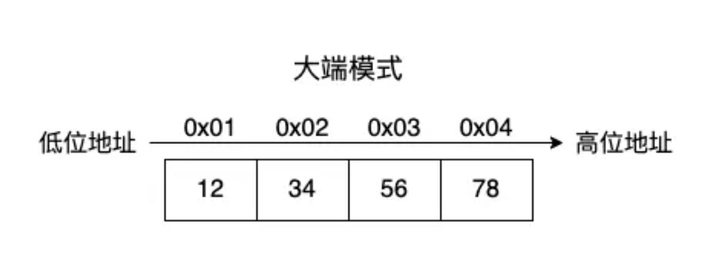
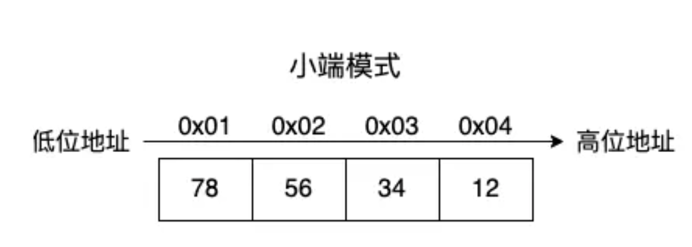
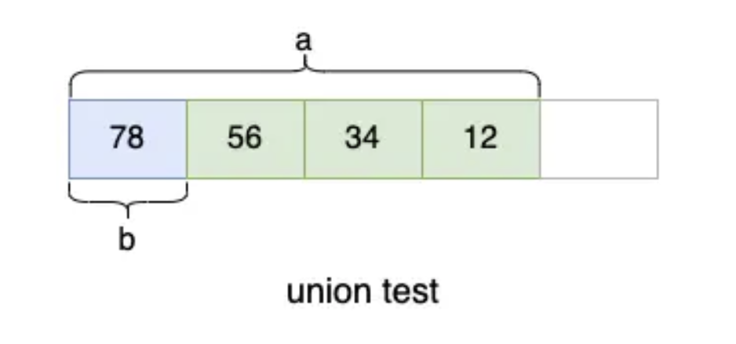
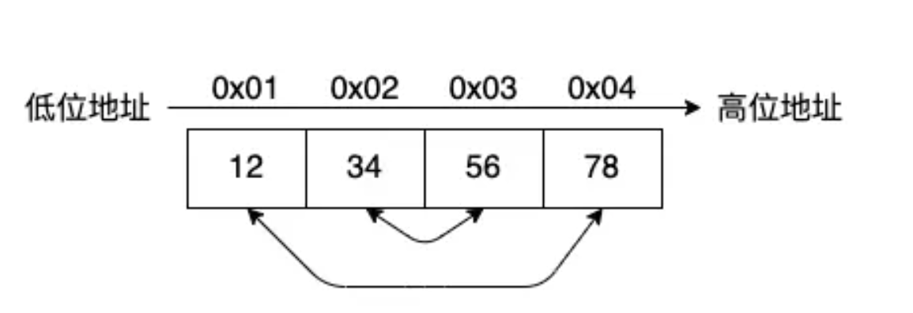

# 大端模式和小端模式

[TOC]

## 什么是大/小端模式

### 大端模式

大端模式（Big-Endian）又称大端字节序，由于在网络传输中一般使用的是大端模式，所以也叫网络字节序。

在大端模式中，将高位字节放在低位地址，低位字节放在高位地址。

举个例子，数值 0x12345678，其中 0x12 这一端是高位字节，0x78 这一端是低位字节。

该数值的存储顺序是这样的：




大端模式符合我们阅读和书写的方式，都是从左到右的。比如 `12345678`，我们只需要按照从左到右的顺序进行阅读和书写就是大端模式的存储顺序了。

### 小端模式

小端模式（Little-Endian）又称小端字节序，由于大多数计算机内部处理使用的是小端模式，所以也叫主机序。

在小端模式中，将高位字节放在高位地址，低位字节放在低位地址。




小端模式比较符合我们人类的思维模式，大的放大的那一边，小的放小的那一边。但是在计算机中存储的顺序与我们看到的顺序是相反的。


## 为什么会有大/小端模式

对于早期的计算机来说，先处理低位字节效率比较高，因为计算都是从低位开始的，所以大多数计算机内部处理使用的是小端模式。但是计算机发展到现在，计算机的处理器相较于以前已经进步很多了，先处理高位还是低位字节的影响已经可以忽略，但是为了向后兼容，保留了大/小端模式。

大端模式更适合程序员阅读，因为看到的内容与输出的内容是一致的。


## 如何判断主机是大端还是小端

###  通过读取低位地址
定义一个 16 位无符号的整数值，然后判断其低位字节存放的位置。

```c
#include <stdio.h>

int main() {
    __uint16_t val = 0x1234;

    char a = ((char *) &val)[0]; // 低位地址
    char b = ((char *) &val)[1]; // 高位地址

    printf("a = %x\n", a);
    printf("b = %x\n", b);

    if (a == 0x34) {
        printf("小端模式\n");
    } else {
        printf("大端模式\n");
    }

    return 0;
}
```


通过 &val 取得 val 的内存地址，然后将其转为 char 类型的指针，再以数组的方式取指针地址上存储的值。

下标 0 可以取到低位地址上的值，下标 1 可以取到高位地址上的值。如果下标 0 取到的是 0x34，说明是小端模式，因为低位字节存储在低位地址上。

我的电脑是小端模式的，最后会输出：

```c
a = 34
b = 12
小端模式
```


###  利用联合体

联合体是一种特殊的数据结构，联合体中的成员变量共用同一段内存。

我们定义一个 test 联合体，设置两个成员变量 a 和 b。

```
#include <stdio.h>

int main()
{
    union test {
        __uint32_t a;
        char b;
    };

    union test val;

    val.a = 0x12345678;

    printf("%x\n", val.b);

    if (val.b == 0x78) {
        printf("小端模式\n");
    } else {
        printf("大端模式\n");
    }

    return 0;
}
```

如果主机是小端模式，`0x12345678` 的存储顺序为：



与第一种方法目的相同，都是通过获取低位地址的第一个字节，判断其存储的内容就可以知道主机是大端还是小端模式，不过这里利用了联合体成员变量共用内存的特点，实现方式更加巧妙。


### 使用 C 语言内置宏

除了上面两种自制的“土方法”，C 语言已经自带了一些宏用来判断主机的字节序。

endian.h 文件：

```c
// 小端模式
# define LITTLE_ENDIAN	__LITTLE_ENDIAN
// 大端模式
# define BIG_ENDIAN	__BIG_ENDIAN
// 当前主机的字节序
# define BYTE_ORDER	__BYTE_ORDER
```


```c
#include <endian.h>

int main()
{
    if (BYTE_ORDER == LITTLE_ENDIAN) {
        printf("小端模式\n");
    } else {
        printf("大端模式\n");
    }

    return 0;
}
```


## 大小端转换

### 为什么需要大小端转换

前面我们提到，在主机基本上使用的都是小端模式，但是在网络传输的时候使用的却是大端模式。

如果我们的程序仅仅是一个单机程序，不需要跟其它程序进行数据交互，那么是不需要进行大小端转换的。

如果程序需要与其它程序进行数据交互，那么在发送数据前，就要将数据从小端模式转换为大端模式。在接收到数据后，将数据从大端模式转换为小端模式。


### 手动实现转换逻辑

只需要将高位字节与低位字节进行交换，就可以实现大小端的转换。




下面是实现代码：

```c
int main()
{
    __uint32_t val = 0x12345678;

    unsigned char *x = (unsigned char *) &val, tmp;

    // 0x78 与 0x12 进行交换
    tmp = x[0];
    x[0] = x[3];
    x[3] = tmp;

    // 0x56 与 0x34 交换
    tmp = x[1];
    x[1] = x[2];
    x[2] = tmp;

    // 输出：0x78563412
    printf("0x%x\n", val);

    return 0;
}
```


### 使用 C 语言内置宏

在 C 语言中已经提供了大小端转换宏在 endian.h 头文件中，下面列出部分：

```c
// 转换 16 位整数
htobe16(x)
be16toh(x)

// 转换 32 位整数
htobe32(x)
be32toh(x)

// 转换 64 位整数
htobe64(x)
be64toh(x)
```

- h 的意思是 host，表示小端模式。
- be 的意思是 big-endian，表示大端模式。
- 16、32、64 的意思是 16 位、32 位、64 位整数，表示不同位数的整数转换。

```c
int main()
{
    __uint32_t val = 0x12345678;
    // 输出：0x78563412
    printf("0x%x\n", htobe32(val));

    return 0;
}
```


## 总结

计算机在处理数据的时候，只会按照顺序去读取字节，不关心数据是大端模式还是小端模式。

程序在读取到数据后，需要判断计算机的大小端模式，来决定是否需要进行大小端转换。

如果读到的第一个字节是高位字节，那么就是大端模式；反之，如果读到的第一个字节是低位字节，那么就是小端模式。


**本文作者**：她和她的猫
**本文地址**：https://her-cat.com/posts/2021/06/14/big-endian-and-little-endian/
**版权声明**：本博客所有文章除特别声明外，均采用 [CC BY-NC-SA 4.0](https://creativecommons.org/licenses/by-nc-sa/4.0/deed.zh) 许可协议。转载请注明出处！
